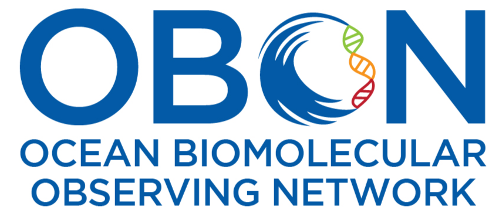

  

# Welcome to Better Biomolecular Ocean Practices (BeBOP)

## About BeBOP

Information about BeBOP protocols can be found at the [BeBOP-OBON GitHub organization](https://github.com/BeBOP-OBON).

## Protocol Templates

Machine-readable protocol templates can be found in the [0_protocol_collection_template repository](https://github.com/BeBOP-OBON/0_protocol_collection_template).

## Metadata Terms

BeBOP makes use of two sets of metadata terms, which improve machine-readability and reporting:

* Minimum Information about an Omics Protocol (MIOP) terms can be be found at the [MIOP GitHub repository](https://github.com/BeBOP-OBON/miop).
* FAIR eDNA (FAIRe) terms can be found at the [FAIRe website](https://fair-edna.github.io/) and [FAIRe checklist repository](https://github.com/FAIR-eDNA/FAIRe_checklist).

## Citation

If you use BeBOP in your research, please cite these papers:

* Pitz, K. J., Thompson, L. R., et al. (2026). BeBOP protocols: Better Biomolecular Ocean Practices through standard formatting, field-specific metadata, and archiving with version control. Submitted to PeerJ.
* Samuel, R. M., Meyer, R., Buttigieg, P. L., Davies, N., Jeffery, N. W., Meyer, C., Pavloudi, C., Pitz, K. J., Sweetlove, M., Theroux, S., Kamp, J. van de, & Watts, A. (2021). Toward a Global Public Repository of Community Protocols to Encourage Best Practices in Biomolecular Ocean Observing and Research. Frontiers in Marine Science, 8, 758694. https://doi.org/10.3389/fmars.2021.758694
